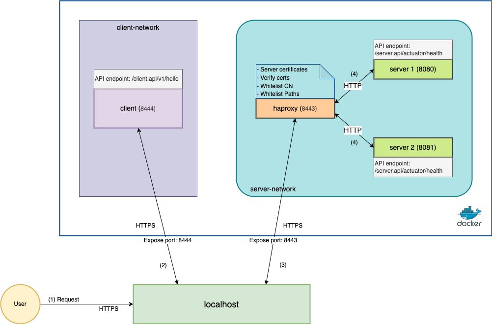

# spring-haproxy-example
A sample Haproxy configuration with Spring Boot Application Backend

What this example includes:
- Generate pem files for haproxy
- Config haproxy
- Create Docker file, docker compose

Source code structure:
- [certs](certs): contains all certificates to config SSL/TLS. You can use these certificates or follow the steps below to generate your certificates
- [server](server): Spring Boot Application Server (HTTP only)
- [client](client): Spring Boot Application Client with Web Client HTTPS config
- [haproxy](haproxy): Config haproxy with Docker

Handle request flow:

In this example, we will call server API via haproxy from a client service or from browser directly.

- From client service: 
    - (1) User call GET API: `https://localhost:8444/client.api/v1/hello`
    - (2) client service: receive request -> call server API via haproxy endpoint `https://host.docker.internal:8443/server.api/v1/user`
    - (3) haproxy receive a request -> verify certificate -> check whitelist -> set headers -> forward request to one of server services
    - (4) server service receive a request -> handle request -> return response

- From browser:
    - (1) User call GET API: `https://localhost:8443/server.api/v1/user`
    - (3) haproxy receive a request -> verify certificate -> check whitelist -> set headers -> forward request to one of server services
    - (4) server service receive a request -> handle request -> return response

## Generate certificates

Refer to [Spring SSL Example](https://github.com/gpcodervn/spring-ssl-example)

In this example, I'm running services in docker container. From inside of a Docker container, the client service can connect to the localhost of the machine
via `host.docker.internal` instead of `localhost`. So, I have to re-generate the `localhost` certificates to include domain name `host.docker.internal`.

Make sure the `localhost.crt` contains DNS `host.docker.internal`

> openssl x509 -in localhost.crt -text

## Generate PEM file

A .pem file is a container format that may just include the public certificate, or the entire certificate chain (private key, public key, root certificates):
- Private Key: must be decrypted
- Server Certificate (crt, puplic key)
- (Optional) Intermediate CA and/or bundles if signed by a 3rd party

Decrypted private key:

> openssl rsa -in localhost.key -out localhost-decrypted.key

+ localhost.key pwd: server123

Output: `localhost-decrypted.key`

Create server PEM file: `localhost.pem`

>  cat localhost-decrypted.key localhost.crt >> localhost.pem

Create CA PEM file: `rootCA.pem`

> cat rootCA.crt > rootCA.pem

## Config haproxy

Refer to [haproxy/start.sh](haproxy/start.sh)

Steps:
- Build server source code
- Build client source code
- Run Docker compose to build docker images and run app in Docker container

## Run apps

Refer to [haproxy](haproxy/README.md)

